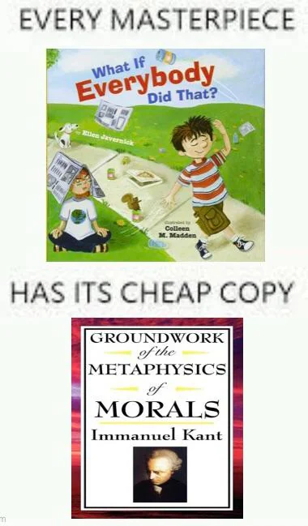
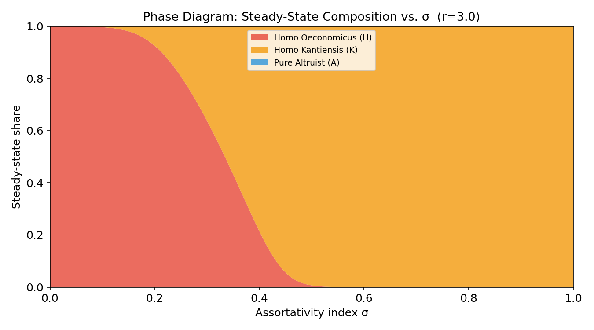
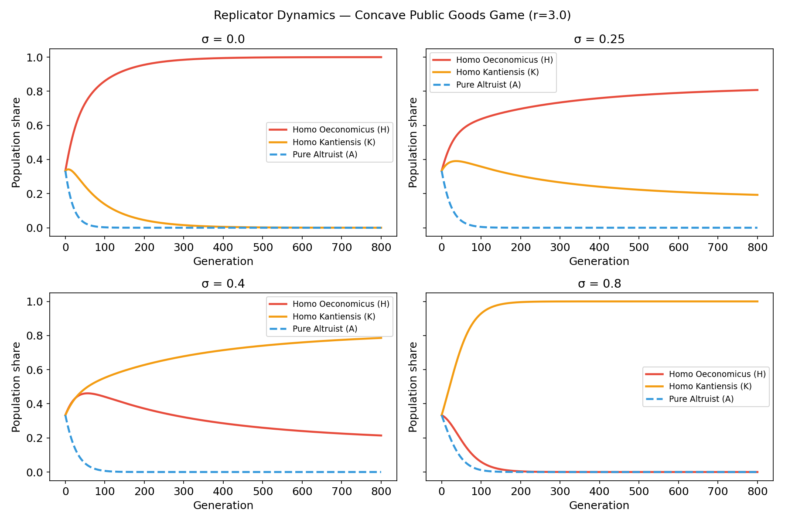
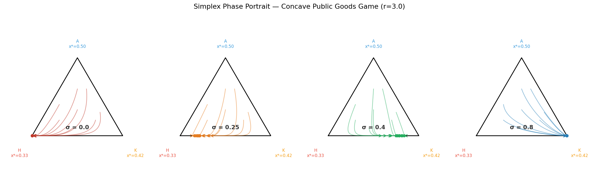

# Kantian Equilibrium in a Concave Public Goods Game

> *What happens when you put a free-rider, a Kantian moralist, and a selfless altruist in the same evolutionary game?*

<p align="center">
  
</p>

This project simulates the evolutionary competition among three preference types — **Homo Oeconomicus**, **Homo Kantiensis**, and **Pure Altruist** — in a two-player concave public goods game with assortative matching, following the framework of [Alger & Weibull (2013)](https://www.econometricsociety.org/publications/econometrica/2013/07/01/homo-moralis-preference-evolution-under-incomplete-information).

---

## The Setup

Each interaction is a public goods game where two players simultaneously choose how much to contribute. The material payoff for player $i$ is:

$$\pi(x_i, x_j) = r(x_i + x_j) - \frac{r(x_i+x_j)^2}{2} - x_i, \quad r = 3$$

The concave return structure (diminishing marginal returns) means there is a well-defined **social optimum** at an interior point — which turns out to be the key to everything.

### Three Types, Three Worldviews

| Label | Type | Utility they maximise | Equilibrium contribution |
|---|---|---|---|
| **H** | Homo Oeconomicus | Own payoff $\pi(x, y)$ | $x_H^{*} = 1/3$ |
| **K** | Homo Kantiensis | "What if everyone did this?" $\pi(x,x)$ | $x_K^{*} = 5/12 \approx 0.417$ |
| **A** | Pure Altruist | Opponent's payoff $\pi(y,x)$ | $x_A^{*} = 1/2$ |

Ordering: $x_H^{*} < x_K^{*} = x_{\text{social}}^{*} < x_A^{*}$. The Kantian strategy is exactly the social optimum. The altruist overshoots it.

### Equilibrium Note

Each type's equilibrium strategy is derived assuming they meet an opponent of the **same type** — population composition is unknown to individual agents and does not enter their optimisation. It only matters at the population level, through the fitness equation.

---

## Assortative Matching & Replicator Dynamics

With assortativity index $\sigma \in [0,1]$, each agent meets a like-type partner with probability $\sigma$ and a random draw from the population otherwise. Fitness:

$$f_i = \sigma \cdot \pi(x_i^{*}, x_i^{*}) + (1-\sigma) \sum_j s_j \cdot \pi(x_i^{*}, x_j^{*})$$

Population shares evolve via the standard replicator equation:

$$s_i(t+1) = s_i(t) + s_i(t)(f_i(t) - \bar{f}(t))$$

---

## Results

### Phase transition at $\sigma \approx 0.35$



- **Low $\sigma$** (anonymous matching): H dominates. Free-riding pays when you'll never see your partner again.
- **High $\sigma$** (tight communities): K dominates. Kantian reasoning implements the social optimum exactly.
- **Pure Altruist: eliminated at every $\sigma$.**

### Why altruism loses — always

The altruist over-contributes ($x_A^{*} > x_{\text{soc}}^{*}$). In a game with diminishing returns, extra contribution beyond the social optimum costs more than it benefits anyone. This gives K a fitness advantage over A against every opponent type:

$$\pi(x_A^{*}, x_j^{*}) < \pi(x_K^{*}, x_j^{*}) \quad \forall\, j$$

Altruism and social efficiency are not the same thing. Over-contribution is the symmetric mirror of free-riding — both deviate from the optimum in opposite directions.

### Population dynamics



### Simplex phase portrait



---

## Files

```
pgg_simulation.ipynb        — main simulation (run this)
Kantian_eq_simplereport.tex — concise academic write-up (model + results only)
report_english.tex          — full paper with discussion
```

The `madoka_*` files are an earlier version with a different thematic framing — same model, same results.

---

## Running

```bash
jupyter notebook Code/pgg_simulation.ipynb
```

Requires: `numpy`, `matplotlib`. Outputs `pgg_*.png` to `Code/`.

---

## Reference

Alger, I., & Weibull, J. W. (2013). Homo Moralis — Preference evolution under incomplete information and assortative matching. *Econometrica*, 81(6), 2269–2302.
